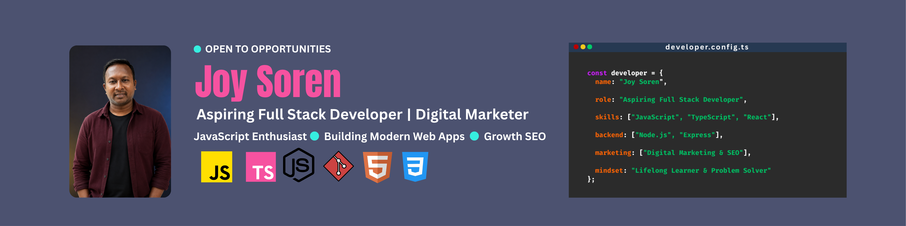

<!-- Banner -->

# Hi, I'm Joy Soren 👋

### Aspiring Full Stack Developer

Building my skills in modern web development, learning through projects, and continuously improving my problem-solving abilities.

---

## 👨‍💻 About Me

I'm an aspiring Full Stack Developer with a growing interest in building modern, responsive, and user-friendly web applications.

I enjoy learning new technologies, solving programming problems, and turning ideas into practical projects. Currently, I'm focused on strengthening my core development skills and growing step by step as a developer.

---

## 🌱 Currently

- 🚀 Learning **React** and modern web development
- 💻 Improving my **JavaScript** and **TypeScript** skills
- 🧩 Building projects and solving programming problems
- 📚 Continuously learning and improving my development skills

---

## 🛠️ Tech Stack

### Frontend

  

### Backend & Tools

  

---

## 🤝 Connect With Me

---

  💻 <b>Code. Learn. Build. Improve.</b> 🚀

